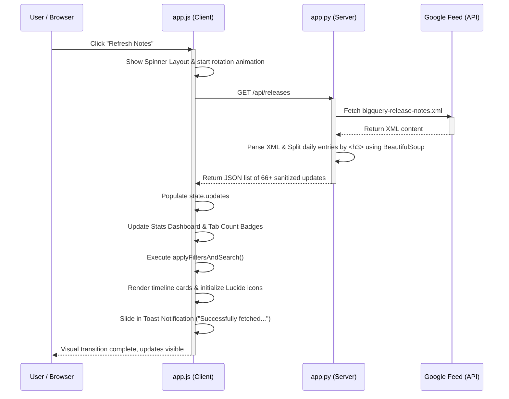

# BigQuery Release Notes Hub

A premium, modern single-page web application (SPA) built using **Python Flask** on the backend and **vanilla HTML/CSS/JavaScript** on the frontend. The dashboard tracks, splits, searches, filters, and formats Google Cloud BigQuery release notes into an elegant, interactive timeline.

---

## 🛠️ Project Structure

- **[app.py](file:///C:/Users/ksukh/agy-cli-projects/bq-releases-notes/app.py)**: The Flask backend that fetches the Google Cloud Atom feed, parses and splits entries, and exposes the JSON API.
- **[templates/index.html](file:///C:/Users/ksukh/agy-cli-projects/bq-releases-notes/templates/index.html)**: The dashboard layout, stats dashboard, category filter tabs, search container, timeline area, and tweet composer modal.
- **[static/css/style.css](file:///C:/Users/ksukh/agy-cli-projects/bq-releases-notes/static/css/style.css)**: Custom CSS design system implementing dark mode, glassmorphic cards, color-coded status badges, timeline lines, scrollbars, and micro-animations.
- **[static/js/app.js](file:///C:/Users/ksukh/agy-cli-projects/bq-releases-notes/static/js/app.js)**: Client-side logic for fetching, rendering, search debouncing, clipboard copying, and the custom Twitter intent composer.
- **[.gitignore](file:///C:/Users/ksukh/agy-cli-projects/bq-releases-notes/.gitignore)**: Standard Git ignore configuration for Python, Flask, Virtual Environments, and IDE files.

---

## ✨ Main Features

1. **Granular Release Splitting**: Google's feed groups multiple release updates under a single day's entry. The application parses the HTML markup and slices it into distinct, individual release cards (e.g. separating a day's *Feature* from an *Issue* or *Announcement*).
2. **Glassmorphic Dark Mode**: A premium, cloud-inspired dark UI using background gradients, glowing borders, custom layout structures, and smooth interactive transitions.
3. **Interactive Search & Filtering**: Client-side filtering by category types (Feature, Announcement, Breaking, Deprecation, Issue, Change) and text keywords, with real-time matching counts displayed on each tab.
4. **Twitter/X Draft Composer**: A modal allowing you to customize, copy, or tweet release updates. Includes default hashtag settings, active character calculations (counting URLs as 23 characters), and an **Auto-Summarize** text shortener to help fit within Twitter's 280-character limit.

---

## 🏗️ Architecture Breakdown

### 1. Server-Side (Flask Backend)
The backend acts as a parser and data proxy. It exposes two routes:
- **Root `/`**: Renders the frontend layout template.
- **API `/api/releases`**:
  - Fetches the Atom feed from `https://docs.cloud.google.com/feeds/bigquery-release-notes.xml`.
  - Parses the XML using `feedparser`.
  - Uses `BeautifulSoup` to scan each entry for `<h3>` tags. It gathers all sibling tags following a header until the next `<h3>` element, splitting bundled daily updates into separate items.
  - Sanitizes hyperlinks (forces `target="_blank"` and `rel="noopener noreferrer"`) and outputs clean HTML and plain-text strings in a JSON payload.

### 2. Client-Side (Vanilla JS Engine)
The frontend manages state locally to provide instant response times:
- **State**: Keeps record of all fetched updates, search criteria, filter tabs, default hashtag settings, and active draft compose state.
- **Timeline Engine**: Iterates over matching updates, compiles elements using custom HTML templates, inserts them into the DOM, and loads Lucide icons.
- **Twitter Assistant**: Computes the draft layout, tracks text progress, blocks pushes over 280 characters, and constructs encoded links targeting Twitter's Web Intent URL.

---

## 🔄 Sample Request-Response Flow

Below is the execution sequence when a user clicks the **"Refresh Notes"** button or loads the page:



---

## 🚀 Run Instructions

### 1. Activate the Virtual Environment
Open your terminal inside the project directory and run:
```powershell
.venv\Scripts\Activate.ps1
```

### 2. Run the Development Server
```powershell
python app.py
```

### 3. Open the Dashboard
Navigate to: [http://127.0.0.1:5000](http://127.0.0.1:5000)
